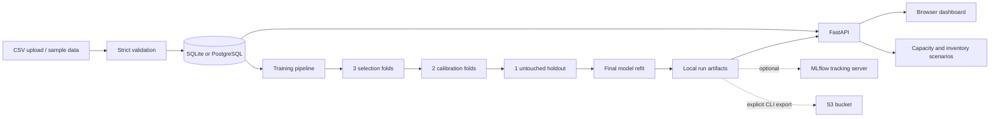

# Architecture and operating model

ForecastLab is a Python application serving a small dependency-free browser frontend. This keeps installation simple while making the data science and engineering layers independently testable.



## Responsibilities

| Module | Responsibility | Does not do |
|---|---|---|
| `data.py` | Validate daily data; generate deterministic samples | Silently impute gaps or zeros |
| `store.py` | Transactional dataset/run persistence and analytical SQL | Train models |
| `models.py` | Historical features, model fitting, recursive prediction, metrics | Access future target values |
| `pipeline.py` | Time splits, per-series selection, calibration, testing, refit | Tune against final holdout |
| `decisions.py` | Deterministic planning arithmetic | Optimize costs or infer causal effects |
| `service.py` | Run lifecycle and saved provenance | Distributed scheduling |
| `api.py` | Input schemas, routes, one background job, static UI | Authentication or multitenancy |
| `integrations.py` | Explicit remote tracking/export | Create cloud infrastructure |

## SQL schema

`datasets`: immutable snapshot metadata, source label, quality/provenance JSON, import timestamp.

`observations`: dataset ID, series ID, ISO calendar date, numeric value. A unique constraint enforces `(dataset_id, series_id, date)`.

`runs`: dataset ID, horizon, state, progress message, creation timestamp, result summary JSON.

Values and timestamps are stored independently: the dataset's observation end date can be years earlier than import/run time. The dashboard does not imply that importing an old dataset makes it current.

SQLAlchemy generates parameterized statements for all application queries. Example analytical SQL is in `sql/analysis.sql`.

## Run lifecycle

```text
queued → running → completed
              └→ failed
```

The service writes forecast, holdout, comparison, model, input, and metadata files under a server-generated run ID. It marks a run complete only after the required artifacts are written. API readers reject incomplete runs.

A process-local lock prevents overlapping server training jobs. At startup, queued/running records are marked failed with an interruption message. Recovery is explicit retraining, not automatic replay.

**One server process is required.** A CLI training command should not run concurrently against the same workspace as server training. For multiple workers or replicas, move training to a durable queue and use distributed job ownership before scaling.

## Artifacts

```text
data/
  forecastlab.db           # SQLite only
  runs/<run-id>/
    input.csv              # normalized snapshot used for this run
    manifest.json          # dataset ID, source hash, quality, provenance
    summary.json           # metrics, splits, coverage, library versions
    comparison.csv         # scores used for selection
    holdout.csv            # untouched test predictions and observed labels
    forecasts.csv          # future predictions and bands
    models.joblib          # fitted final models plus history and interval widths
```

A PostgreSQL deployment still needs persistent artifact storage; the Compose example mounts separate database and artifact volumes.

The raw CSV hash refers to the imported bytes, which can differ from normalized `input.csv` serialization. Both provenance and normalized observations are preserved; different CSV formatting can produce different raw hashes without changing the data values.

## Deployment boundary

The CLI defaults to loopback (`127.0.0.1`). Compose exposes the application on loopback and keeps PostgreSQL internal. The Docker process runs as a non-root user and has a health check.

The local application has no login, rate limiter, tenant isolation, TLS terminator, or distributed job queue. Before external deployment, add authentication/authorization, CSRF protection appropriate to the chosen authentication, request-size limits at the reverse proxy, durable queue workers, job leases, monitoring/retention policies, secret management, and backup/restore procedures.

Do not claim that the provided Docker configuration or source code constitutes a production AWS deployment.

## Failure behavior

- Invalid CSV: 422 with a useful validation message; dataset transaction is not created.
- Insufficient history: 422 before training starts.
- Another training job running: 409.
- Incomplete run requested: 409.
- Missing dataset/series/run/artifact kind: 404.
- Training exception: run becomes failed; detailed traceback remains in server logs.
- MLflow logging failure: run succeeds locally with a tracking warning.
- Database health failure: health endpoint returns 503.
- Browser request failure: visible error message; no fabricated placeholder results.
